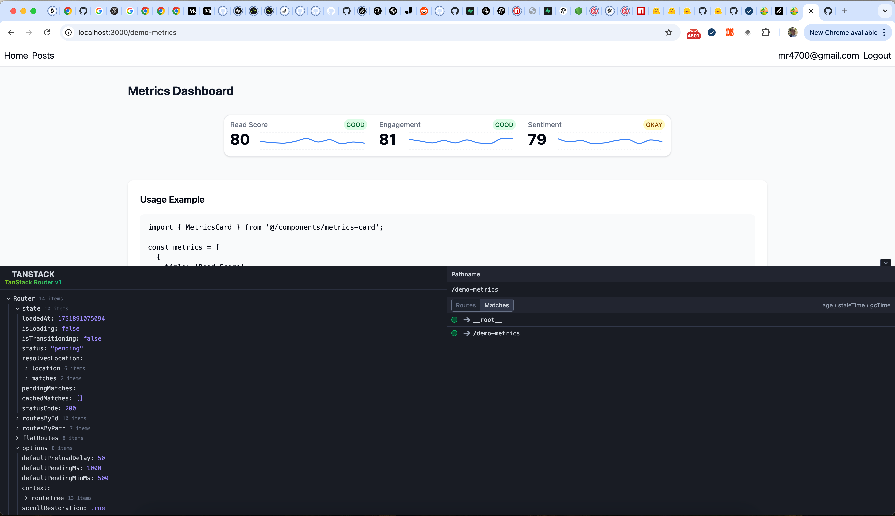

# Frontend



## Overview
This is the frontend for the Demo project. It provides a modern, type-safe, and highly interactive user interface for authentication, metrics visualization, and post management.

## Features
- **Authentication:** Sign up, login, and logout with Supabase integration.
- **Metrics Dashboard:** Visualize metrics using interactive charts.
- **Posts Management:** View, navigate, and interact with posts.
- **Error Boundaries:** Friendly error handling and navigation.
- **Responsive Design:** Works across devices with dark/light mode support.

## Tech Stack
- **React 19**: UI library for building interactive interfaces.
- **TypeScript**: Type safety across the codebase.
- **Vite**: Fast development and build tool.
- **TanStack Router & TanStack Start**: Client-first, type-safe routing and SSR framework.
- **Tailwind CSS**: Utility-first CSS framework for rapid UI development.
- **shadcn/ui**: Accessible UI components.
- **Supabase**: Backend-as-a-service for authentication and data.
- **Recharts**: Charting library for metrics visualization.

## Getting Started
1. Install dependencies:
   ```bash
   npm install
   ```
2. Start the development server:
   ```bash
   npm run dev
   ```

## File Structure
- `src/` — Main source code (routes, components, utils)

## Requirements
- Node.js 22+
- See `.env.example` for environment variables

---
For more details, see inline comments and documentation in the codebase.
